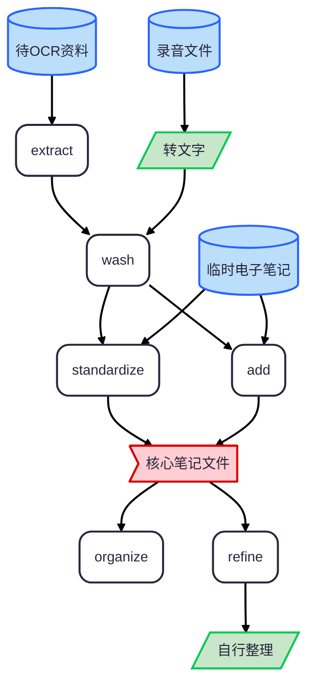

<h1 align="center">Ordinote: General Note Organizer</h1>

<p align="center">
  
  
</p>

通用笔记整理技能，处理 OCR 识别笔记、课堂笔记、读书笔记等各类 markdown 笔记的整理、合并、补充与归档。

## 功能

| # | 功能      | 说明                                                                | 定义文件                                  |
| - | ------- | ----------------------------------------------------------------- | ------------------------------------- |
| 1 | 初始化整理   | 整理原始 OCR 笔记：修错别字、按板块归类（分类规则见 `ordinote-standardize.md`）、公式转 LaTeX；不添加不删改内容             | `references/ordinote-wash.md`         |
| 2 | 添加内容    | 将新笔记（子笔记）按内容归入已有的整理笔记（母笔记），格式向母笔记看齐；母/子内容零删改                      | `references/ordinote-add.md`          |
| 3 | 补充完善    | 识别笔记中缩写、略写、乱码公式等略写部分，联网搜索补全；新增内容用淡粉色 `<mark>` 高亮，原公式旁追加 LaTeX 转写  | `references/ordinote-enrich.md`       |
| 4 | 规范化整理   | 将笔记重组为结构清晰的整理版（`{原文件名}-整理版.md`）：有以往整理笔记则参考其格式，否则按笔记逻辑自行组织；仅调序不改内容 | `references/ordinote-standardize.md`    |
| 5 | 文件夹结构整理 | 规划目标文件夹的笔记归档结构：先出方案（逻辑归属、聚类、合理嵌套），用户确认后才移动文件；只移动，不删改、不重命名         | `references/ordinote-organize.md` |
| 6 | PDF/PPT/图片提取 | 调用脚本提取 PDF/PPT/DOC/图片文字为提取稿（本地或 MinerU API）；只负责提取，整理交由 `ordinote-wash`；提取失败如实告知，不编造 | `references/ordinote-extract.md`        |

## 脚本

| 脚本                         | 说明                                                                                                                                                                                                                                              |
| -------------------------- | ------------------------------------------------------------------------------------------------------------------------------------------------------------------------------------------------------------------------------------------------- |
| `scripts/extract_local.py` | 本地提取 PDF/PPTX 全部文字，生成 `{原文件名}-提取.md`；分页/分幻灯片以 `---` 分隔，保留 PPT 演讲者备注；扫描版 PDF 提取失败时退出码 2                                                                                          |
| `scripts/mineru_api.py`    | MinerU 精准解析 API（云端备选），适用于扫描件、复杂版式；支持 PDF/PPT/DOC 及图片（png/jpg/jpeg/jp2/webp/gif/bmp）OCR，支持多文件批量（每批 ≤ 50 个）与指定页码解析；Token 通过 PowerShell 配置到环境变量 `MINERU_API_TOKEN` |

## 使用

### 安装

- 将 `ordinote-organizer.zip` 上传到 Agent 客户端的技能上传/安装界面
- 直接将 `ordinote-organizer.zip` 发送给模型，让其帮忙在客户端安装

### 在对话中激活

对模型说"整理笔记"、"补充完善这篇笔记"、"整理这个文件夹"、"把这个 PPT 整理成文档"等即可触发对应功能；技能入口与各功能的详细规范见 `SKILL.md` 与 `references/`

### 配置 MinerU API

云端提取（`scripts/mineru_api.py`）需配置 Token；本地提取（`extract_local.py`）无需配置。

1. 在 [MinerU API 管理页](https://mineru.net/apiManage/docs) 创建 Token
2. 用 PowerShell 永久写入环境变量（一台电脑配置一次即可）：

    ```powershell
    [Environment]::SetEnvironmentVariable("MINERU_API_TOKEN", "你的token", "User")
    ```

3. 重开终端后生效；重启终端后，使用以下命令检查是否完成配置：

    ```powershell
    $env:MINERU_API_TOKEN
    ```

### 笔记工作流

- 圆柱：输入资料
- 平行四边形：人工处理
- 圆角矩形：LLM + skill 处理



